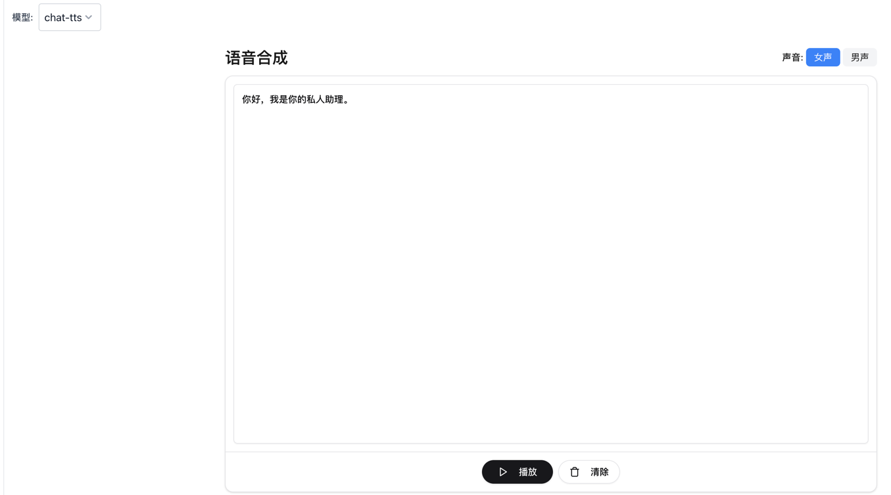

ChatTTS VLLM & API
========================

基于官方VLLM结构改进的ChatTTS推理方案，具备准实时语音合成能力。

## 特性：
- 支持openai标准规范的语音合成接口
- 扩展流式和非流式语音合成方法
- 最快推理RTF约为0.15
- 支持并行多路同时合成
- 优化多句话合成音色不稳定的问题。

## 快速体验
感谢bella开源项目提供资源试点 https://api.bella.top/playground 语音合成（模型选择chat-tts）或者实时语音对话（选择bella-realtime模型）


## 安装方式
```bash
Clone Repo
git clone https://github.com/fengyizhu/ChatTTS
cd ChatTTS
```
安装依赖
```bash
pip install --upgrade -r requirements.txt
```
运行
```bash
python -m examples/api/openai.py
```
同步接口用例
```bash
curl -X POST "http://localhost:8080/v1/audio/speech" \
-H "Content-Type: application/json" \
-d '{
  "model": "chat-tts",
  "voice": "28",
  "input": "你好，今天天气怎么样。",
  "response_format": "pcm",
  "stream": false,
}'
```
流式接口用例
```bash
curl -X POST "http://localhost:8080/v1/audio/speech" \
-H "Content-Type: application/json" \
-d '{
  "model": "chat-tts",
  "voice": "28",
  "input": "你好，今天天气怎么样。",
  "response_format": "pcm",
  "stream": true,
}'
```


